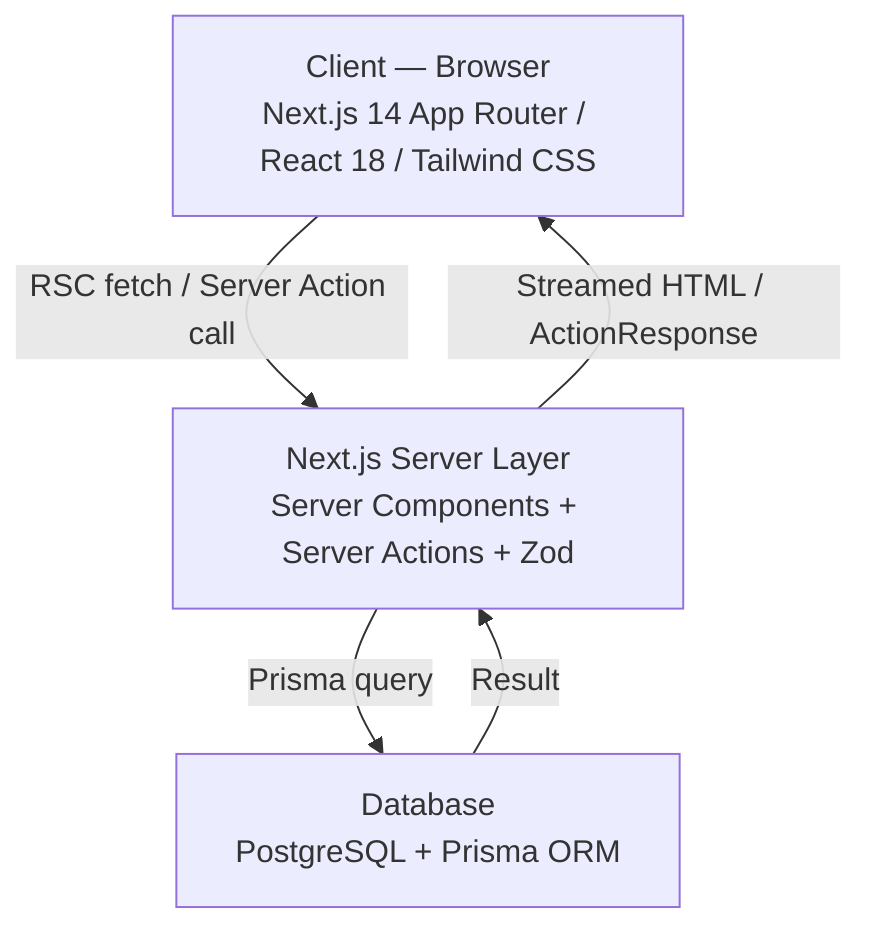
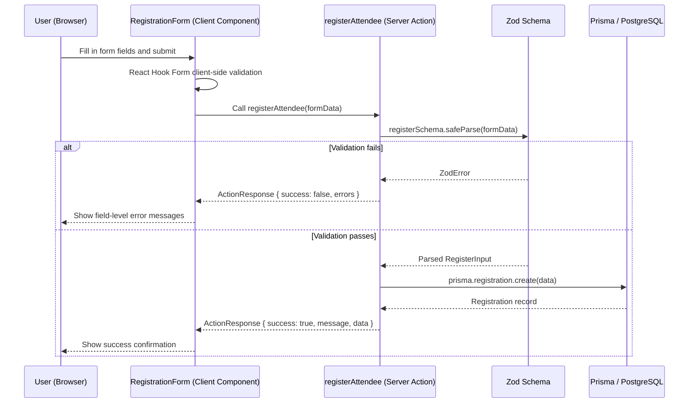
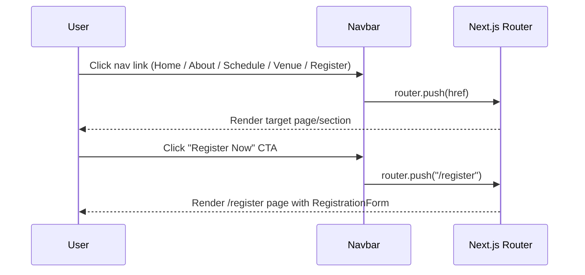

# Design Document: Destiny Limitations 2026 — Conference Web Application

## Overview

The **Destiny Limitations 2026** application is a full-stack, responsive conference web application for the **2026 Amsterdam Convention — "Breaking Destiny Limitations"**, a religious convention ministered by Fr. Emmanuel Obimma (Ebube Muonso). The application provides event information, a program schedule, venue details, and an online attendee registration system.

The application is built on **Next.js 14+** with the App Router, **Tailwind CSS v3** for styling, **Prisma ORM** against PostgreSQL for persistence, and **Zod** for validation. Design cues are drawn directly from the event poster: diagonal clip-path hero sections, a tricolor (Red / White / Blue) top accent stripe on the navbar, and a bold brand palette of burgundy, crimson, gold, cream, and navy.

---

## Architecture



### Technology Stack

| Layer | Technology |
|-------|-----------|
| Framework | Next.js 14+ (App Router, Server Components, Server Actions) |
| Styling | Tailwind CSS v3 + clsx / tailwind-merge + Framer Motion |
| Icons | Lucide React |
| Validation | Zod |
| Database | PostgreSQL via Prisma ORM (SQLite via Drizzle for local dev) |
| Form State | React Hook Form + @hookform/resolvers/zod |
| Fonts | Oswald / Montserrat (headings), Inter (body) |

---

## Design System

### Color Palette (`tailwind.config.js` brand tokens)

```typescript
// tailwind.config.js
module.exports = {
  theme: {
    extend: {
      colors: {
        brand: {
          burgundy: "#7A0C1B",  // Dominant background / primary action
          crimson:  "#B31B2C",  // Secondary buttons, accents, highlights
          gold:     "#D29034",  // Badges, borders, emphasis
          cream:    "#FBF3E8",  // Card containers / subtle backgrounds
          navy:     "#10233D",  // Header background / deep contrast
          red:      "#C0121A",  // High-energy accents
        },
      },
      fontFamily: {
        heading: ["Oswald", "Montserrat", "sans-serif"],
        body:    ["Inter", "system-ui", "sans-serif"],
      },
    },
  },
}
```

### UI Style Rules

- **Hero Banner:** Diagonal section dividers using `clip-path: polygon(...)` mirroring dynamic poster angles. Angle intensity reduces on mobile (< 640 px).
- **Top Accent Strip:** Tricolor stripe (Red / White / Blue) at the very top of the navbar/header.
- **Typography:** Bold, tall uppercase headers for key theme statements (`BREAKING DESTINY LIMITATIONS`).
- **Cards:** Cream background (`#FBF3E8`) with gold accent borders (`#D29034`).
- **Accessibility:** WCAG AA contrast required between cream containers and burgundy text; all form fields must carry proper `aria-label` / `aria-describedby` attributes and visible error states.

---

## Sequence Diagrams

### Registration Flow



### Page Navigation Flow



---

## Components and Interfaces

### Component: `Navbar`

**Purpose:** Sticky navigation bar rendered as a Server Component shell with an optional client island for mobile menu toggle.

**Interface:**

```typescript
// components/navbar.tsx
interface NavbarProps {
  currentPath?: string;
}

interface NavLink {
  label: string;        // e.g. "Home", "Schedule"
  href: string;         // e.g. "/", "/schedule"
  isActive?: boolean;
}
```

**Responsibilities:**

- Render tricolor (Red / White / Blue) top accent stripe.
- Render logo and ministry title on the left.
- Render nav links (Home, About, Schedule, Venue, Register) in the center.
- Render "Register Now" CTA button (brand-crimson) on the right.
- Collapse to hamburger menu on mobile.

---

### Component: `Hero`

**Purpose:** Full-width hero section with diagonal clip-path, event title, theme statement, speaker name, and CTAs.

**Interface:**

```typescript
// components/hero.tsx
interface HeroProps {
  title: string;         // "2026 AMSTERDAM CONVENTION"
  theme: string;         // "BREAKING DESTINY LIMITATIONS"
  scripture: string;     // "1 Chronicles 4:10"
  speaker: string;       // "Fr. Emmanuel Obimma (Ebube Muonso)"
}
```

**Responsibilities:**

- Display headline, theme, scripture reference, and speaker name.
- Render two CTA buttons: "Register Now" → `/register`, "View Schedule" → `/#schedule`.
- Apply diagonal `clip-path` bottom edge for visual flair.
- Use brand-burgundy background with cream/gold text.

---

### Component: `ScheduleTimeline`

**Purpose:** Interactive timeline or tabbed layout displaying the daily program.

**Interface:**

```typescript
// components/schedule-timeline.tsx
interface ScheduleSession {
  startTime: string;   // "12:00"
  endTime: string;     // "18:00"
  title: string;       // "Daily Consultation"
  description?: string;
}

interface ScheduleTimelineProps {
  sessions: ScheduleSession[];
  date?: string;       // e.g. "Daily"
}
```

**Responsibilities:**

- Render session blocks for: 12:00–18:00 Consultation and 18:00–22:00 Holy Mass & Adoration.
- Provide accessible tab or timeline UI.
- Use gold accent for time indicators.

---

### Component: `RegistrationForm`

**Purpose:** Controlled client component for attendee registration, integrating React Hook Form + Zod.

**Interface:**

```typescript
// components/registration-form.tsx
interface RegistrationFormProps {
  onSuccess?: (data: Registration) => void;
}

// Field values mirror RegisterInput (from Zod schema)
interface RegistrationFormValues {
  fullName:       string;
  email:          string;
  phone:          string;
  country:        string;
  city:           string;
  attendanceType: "FULL_CONVENTION" | "CONSULTATION_ONLY" | "HOLY_MASS_ONLY";
}
```

**Responsibilities:**

- Render labeled inputs: Full Name, Email, Phone, Country, City, Attendance Type (select/radio).
- Apply React Hook Form validation via Zod resolver.
- Call `registerAttendee` server action on submit.
- Display field-level error messages via `aria-describedby`.
- Show success or server-error feedback after submission.
- Disable submit button while pending.

---

### Component: `VenueCard`

**Purpose:** Venue information card with address and map/directions link.

**Interface:**

```typescript
// components/venue-card.tsx
interface VenueCardProps {
  name: string;       // "Amsterdam Convention Centre"
  address: string;    // "Zaaiersweg 180, 1097 ST Amsterdam, The Netherlands"
  mapUrl?: string;    // Google Maps / OpenStreetMap embed URL
}
```

**Responsibilities:**

- Display address with a map icon (Lucide `MapPin`).
- Provide "Get Directions" link opening in a new tab.
- Optionally embed an `<iframe>` map.

---

### Component: `Footer`

**Purpose:** Persistent site footer with coordinator contact info and slogan.

**Interface:**

```typescript
// components/footer.tsx
interface Coordinator {
  name: string;
  role?: string;
  contact?: string;
}

interface FooterProps {
  coordinators: Coordinator[];
  slogan: string;
  quickLinks: NavLink[];
  copyrightYear: number;
}
```

**Responsibilities:**

- Display coordinator details (Ugochukwu Ndukaihe & Augustine Amadike).
- Show slogan: *"…If there's someone to pray, there is a God to answer…"*
- Render quick navigation links.
- Show copyright notice.

---

### UI Primitives

#### `Button`

```typescript
// components/ui/button.tsx
interface ButtonProps extends React.ButtonHTMLAttributes<HTMLButtonElement> {
  variant: "primary" | "secondary" | "outline";
  size?: "sm" | "md" | "lg";
  isLoading?: boolean;
  children: React.ReactNode;
}
// primary   → brand-crimson background, cream text
// secondary → brand-gold background, navy text
// outline   → transparent, brand-gold border, cream text
```

#### `Card`

```typescript
// components/ui/card.tsx
interface CardProps {
  children: React.ReactNode;
  className?: string;
  withGoldBorder?: boolean;
}
// Background: brand-cream (#FBF3E8)
// Border: brand-gold (#D29034) when withGoldBorder=true
```

---

## Data Models

### `Registration`

```typescript
// Prisma model — prisma/schema.prisma
model Registration {
  id             String             @id @default(uuid())
  fullName       String
  email          String
  phone          String
  country        String
  city           String
  attendanceType AttendanceType     @default(FULL_CONVENTION)
  status         RegistrationStatus @default(CONFIRMED)
  createdAt      DateTime           @default(now())
  updatedAt      DateTime           @updatedAt

  @@index([email])
}

enum AttendanceType {
  FULL_CONVENTION
  CONSULTATION_ONLY
  HOLY_MASS_ONLY
}

enum RegistrationStatus {
  PENDING
  CONFIRMED
  CANCELLED
}
```

**Validation Rules:**

- `fullName`: non-empty, minimum 2 characters.
- `email`: valid email format; indexed for deduplication queries.
- `phone`: minimum 8 characters, non-empty.
- `country`: minimum 2 characters.
- `city`: minimum 2 characters.
- `attendanceType`: must be one of the three enum values.

---

## Key Functions with Formal Specifications

### `registerAttendee` (Server Action)

```typescript
// app/actions/register.ts
export async function registerAttendee(
  input: RegisterInput
): Promise<ActionResponse<Registration>>
```

**Preconditions:**
- `input` is a non-null object supplied by the form submission.
- `input.email` is a syntactically valid email string.
- `input.fullName.length >= 2`.
- `input.phone.length >= 8`.
- `input.country.length >= 2` and `input.city.length >= 2`.
- `input.attendanceType` ∈ `{ "FULL_CONVENTION", "CONSULTATION_ONLY", "HOLY_MASS_ONLY" }`.

**Postconditions:**
- If validation fails: returns `ActionResponse { success: false, errors: Record<string, string[]> }` with no database write.
- If validation passes: a new `Registration` row is persisted with `status = CONFIRMED`; returns `ActionResponse { success: true, message: string, data: Registration }`.
- The returned `data.id` is a valid UUID string.
- No mutation of `input` occurs.

**Error Handling:**
- Database errors are caught and returned as `ActionResponse { success: false, message: "Registration failed. Please try again." }`.

---

### `registerSchema` (Zod Validation Schema)

```typescript
// lib/validations/register.ts
export const registerSchema = z.object({
  fullName:       z.string().min(2, "Full name must be at least 2 characters"),
  email:          z.string().email("Invalid email address"),
  phone:          z.string().min(8, "Phone number is required"),
  country:        z.string().min(2, "Country is required"),
  city:           z.string().min(2, "City is required"),
  attendanceType: z.enum(["FULL_CONVENTION", "CONSULTATION_ONLY", "HOLY_MASS_ONLY"]),
});

export type RegisterInput = z.infer<typeof registerSchema>;
```

**Postconditions:**
- `registerSchema.safeParse(x).success === true` implies all field constraints are satisfied.
- `registerSchema.safeParse(x).success === false` implies `error.flatten().fieldErrors` contains at least one entry.

---

### `ActionResponse<T>` (Shared Response Type)

```typescript
// lib/types.ts
export type ActionResponse<T> = {
  success: boolean;
  message: string;
  data?:   T;
  errors?: Record<string, string[]>;
};
```

**Invariant:**
- `success === true` implies `errors` is `undefined`.
- `success === false` implies `data` is `undefined`.

---

## Algorithmic Pseudocode

### Main Registration Algorithm

```typescript
// Pseudocode representation of registerAttendee
async function registerAttendee(rawInput: unknown): Promise<ActionResponse<Registration>> {
  // Step 1: Validate
  const parsed = registerSchema.safeParse(rawInput);
  if (!parsed.success) {
    return {
      success: false,
      message: "Validation failed",
      errors:  parsed.error.flatten().fieldErrors,
    };
  }

  // Step 2: Persist
  try {
    const record = await prisma.registration.create({
      data: {
        ...parsed.data,
        status: "CONFIRMED",
      },
    });
    return { success: true, message: "Registration successful!", data: record };
  } catch (err) {
    return { success: false, message: "Registration failed. Please try again." };
  }
}
```

**Preconditions:** `rawInput` is a serializable object from a form POST or Server Action call.  
**Postconditions:** Either a validation error response (no DB write) or a success response with a persisted record.  
**Loop Invariants:** N/A (no loops).

---

## Example Usage

```typescript
// In a React Server Component page (app/register/page.tsx)
import { RegistrationForm } from "@/components/registration-form";

export default function RegisterPage() {
  return (
    <main className="min-h-screen bg-brand-burgundy py-16">
      <div className="mx-auto max-w-xl px-4">
        <h1 className="font-heading text-4xl font-bold uppercase text-brand-gold mb-8">
          Register for the Convention
        </h1>
        <RegistrationForm />
      </div>
    </main>
  );
}

// Client-side form submission (within RegistrationForm component)
const { handleSubmit } = useForm<RegistrationFormValues>({
  resolver: zodResolver(registerSchema),
});

const onSubmit = async (values: RegistrationFormValues) => {
  const response = await registerAttendee(values);
  if (response.success) {
    toast.success(response.message);
  } else {
    // Map field errors back to React Hook Form
    Object.entries(response.errors ?? {}).forEach(([field, messages]) => {
      form.setError(field as keyof RegistrationFormValues, {
        message: messages[0],
      });
    });
  }
};
```

---

## Error Handling

### Scenario 1: Invalid Form Input

**Condition:** User submits a form with missing or malformed fields.  
**Response:** Zod `safeParse` returns `success: false`; the server action returns `ActionResponse { success: false, errors }` without writing to the database. The client maps each field error to its input via React Hook Form `setError`.  
**Recovery:** User corrects the highlighted fields and resubmits.

### Scenario 2: Database Error

**Condition:** Prisma `create` throws (network failure, constraint violation, DB unavailable).  
**Response:** The server action catches the error and returns `ActionResponse { success: false, message: "Registration failed. Please try again." }`. No partial record is created.  
**Recovery:** User can retry; a retry button is shown in the form's error state.

### Scenario 3: Duplicate Registration

**Condition:** The same email is submitted more than once.  
**Response:** Database unique constraint (or application-level check) prevents duplicate; the server action returns a user-friendly message: `"An attendee with this email is already registered."`.  
**Recovery:** User is informed to use a different email or contact the coordinators.

---

## Testing Strategy

### Unit Testing Approach

- Test `registerSchema` Zod validation with valid and invalid input shapes.
- Test `registerAttendee` server action logic using mocked Prisma client.
- Test UI components (`Button`, `Card`, `Navbar`, `Footer`) for correct rendering of brand tokens.
- Test `RegistrationForm` error-state rendering with React Testing Library.

### Property-Based Testing Approach

**Property Test Library:** fast-check

Property tests focus on universal properties of validation and data transformation logic.

### Integration Testing Approach

- Test full registration flow against a test database (SQLite via Drizzle for CI speed).
- Verify that submitting a valid form creates a database record and returns `success: true`.
- Verify that re-submitting the same email returns a duplicate-detection error.

---

## Performance Considerations

- **Static generation:** All purely informational pages (Home, About, Schedule, Venue) should be statically generated (`generateStaticParams` / no dynamic data).
- **Server Components default:** Only the `RegistrationForm` and mobile hamburger menu require client components; everything else is RSC.
- **Image optimization:** Use `next/image` with proper `width`, `height`, and `priority` for the hero speaker image.
- **Font loading:** Load Oswald and Inter via `next/font/google` with `display: swap` to avoid layout shift.

---

## Security Considerations

- **Input validation:** All form data is validated with Zod on the server before any DB interaction; client validation is a UX enhancement only.
- **SQL injection:** Prisma parameterized queries prevent SQL injection by design.
- **CSRF:** Next.js Server Actions include CSRF protection by default via the origin header check.
- **PII handling:** Email addresses are stored but not publicly exposed; the `@@index([email])` is for performance, not uniqueness enforcement (application layer handles duplicates).
- **Environment variables:** `DATABASE_URL` must be set via `.env.local`; never commit secrets to the repository.

---

## Dependencies

| Package | Version | Purpose |
|---------|---------|---------|
| next | ^14.0.0 | Framework (App Router, Server Actions) |
| react | ^18.0.0 | UI rendering |
| tailwindcss | ^3.0.0 | Utility-first CSS |
| clsx | ^2.0.0 | Conditional class names |
| tailwind-merge | ^2.0.0 | Merge Tailwind classes without conflicts |
| framer-motion | ^11.0.0 | Smooth UI animations |
| lucide-react | ^0.300.0 | Icon library |
| zod | ^3.0.0 | Schema validation |
| @prisma/client | ^5.0.0 | Type-safe DB client |
| prisma | ^5.0.0 | ORM / migration tooling |
| react-hook-form | ^7.0.0 | Form state management |
| @hookform/resolvers | ^3.0.0 | Zod resolver for RHF |

---

## Correctness Properties

*A property is a characteristic or behavior that should hold true across all valid executions of a system — essentially, a formal statement about what the system should do. Properties serve as the bridge between human-readable specifications and machine-verifiable correctness guarantees.*

### Property 1: Schema Rejects All Invalid Inputs

*For any* input object that violates at least one field constraint — including `fullName` shorter than 2 characters, a malformed `email` string, `phone` shorter than 8 characters, `country` or `city` shorter than 2 characters, or an `attendanceType` value outside the three valid enum members — `registerSchema.safeParse(input).success` must equal `false` and `error.flatten().fieldErrors` must contain at least one entry identifying the offending field.

**Validates: Requirements 8.1, 8.2, 8.3, 8.4, 8.5, 8.6, 8.8**

### Property 2: Schema Accepts All Valid Inputs (Round Trip)

*For any* input object where every field satisfies its minimum-length constraint, `email` is a syntactically valid address, and `attendanceType` is one of the three accepted enum values, `registerSchema.safeParse(input).success` must equal `true` and the parsed output must be structurally equivalent to the input (field values are preserved unchanged).

**Validates: Requirements 8.7**

### Property 3: Registration Persistence Round Trip

*For any* valid `RegisterInput`, calling `registerAttendee(input)` and receiving `ActionResponse { success: true }` implies that a `Registration` record exists in the database whose `fullName`, `email`, `phone`, `country`, `city`, and `attendanceType` fields are identical to the corresponding fields of the original input.

**Validates: Requirements 10.3, 10.4**

### Property 4: No Database Write on Invalid Input

*For any* input that fails `registerSchema` validation, calling `registerAttendee(input)` must return `ActionResponse { success: false }` and must not create any new row in the `Registration` table. The total row count of the table must be unchanged.

**Validates: Requirements 10.2**

### Property 5: ActionResponse Structural Invariant

*For any* call to `registerAttendee`, the returned `ActionResponse` must satisfy both of the following simultaneously: (a) `success === true` implies `errors === undefined`, and (b) `success === false` implies `data === undefined`.

**Validates: Requirements 12.2, 12.3**

### Property 6: Duplicate Email Rejection

*For any* valid `RegisterInput` whose `email` value already exists in the `Registration` table, calling `registerAttendee(input)` must return `ActionResponse { success: false }` with a `message` indicating the duplicate, and must not create a second `Registration` row for that email.

**Validates: Requirements 10.7**

### Property 7: Button Variant Styling Invariant

*For any* `Button` component rendered with `variant="primary"`, the resulting DOM element must carry CSS classes resolving to a `brand-crimson` (`#B31B2C`) background. *For any* `Button` with `variant="secondary"`, the background must resolve to `brand-gold` (`#D29034`). *For any* `Button` with `variant="outline"`, the background must be transparent with a `brand-gold` border.

**Validates: Requirements 2.2, 2.3, 2.4**

### Property 8: Loading Button is Always Disabled

*For any* `Button` rendered with `isLoading={true}`, regardless of other props, the button element must have the `disabled` attribute set and must not be interactive.

**Validates: Requirements 2.5**

### Property 9: Form Error Association Invariant

*For any* `RegistrationForm` state where one or more fields carry a validation error, every visible error message element must be referenced by the `aria-describedby` attribute of its corresponding `<input>` or `<select>` element.

**Validates: Requirements 9.3, 9.4, 13.2, 13.3**

### Property 10: ServerAction Input Immutability

*For any* `RegisterInput` object passed to `registerAttendee`, the properties of that object must be identical (by value) before and after the server action call completes — the action must never mutate its input parameter.

**Validates: Requirements 10.6**
